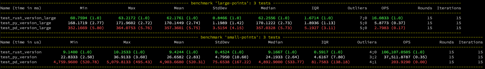
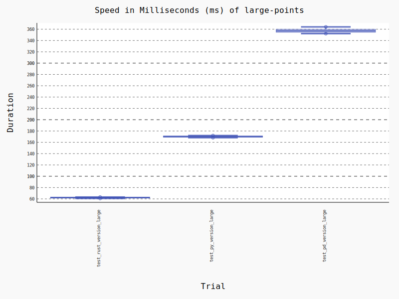
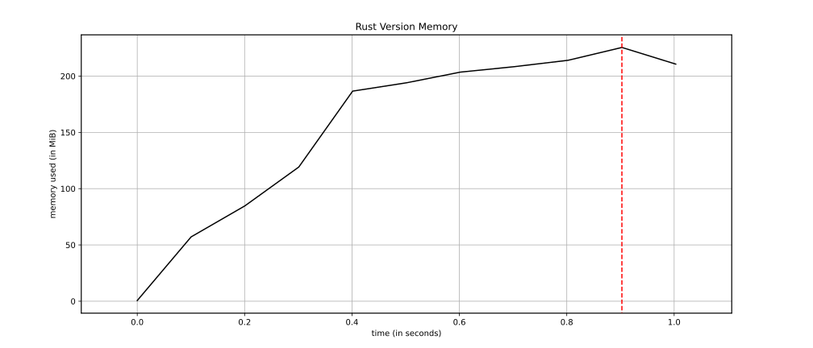
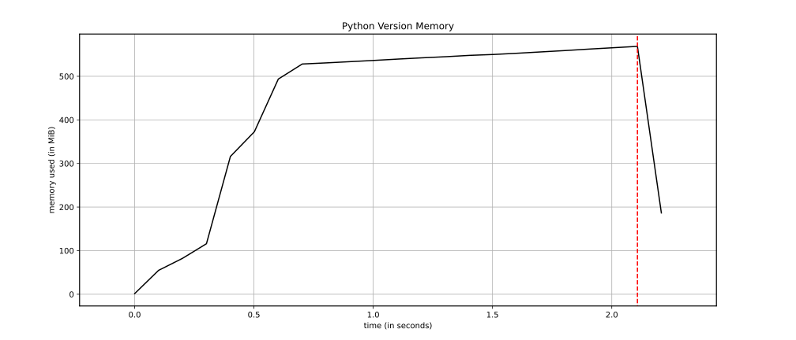
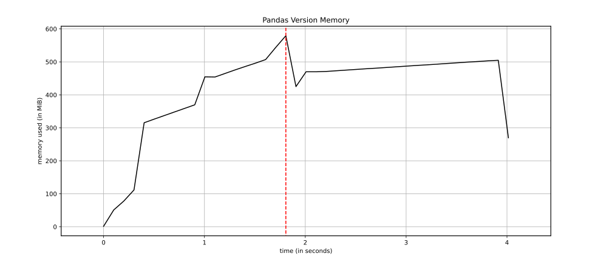

# Custom WKT

[](https://github.com/user01/custom-wkt/actions/workflows/rust.yml)

Tooling to render WKT values based on specific, custom data layouts.

Given two series of 2-D data, grouped by classes, render into a list of [WKT `LINESTRING`s](https://en.wikipedia.org/wiki/Well-known_text_representation_of_geometry).

```python
import custom_wkt
import numpy as np

custom_wkt.linestring(np.linspace(0, 5, 6), np.linspace(0, 5, 6) / 2.0, np.array([0, 0, 0, 0, 1, 1]), 1)
# ['LINESTRING (0.0 0.0, 1.0 0.5, 2.0 1.0, 3.0 1.5)', 'LINESTRING (4.0 2.0, 5.0 2.5)']
```

## Operation

|   x |   y |   c |
|-----|-----|-----|
| 0.0 | 0.0 | 0   |
| 1.0 | 0.5 | 0   |
| 2.0 | 1.0 | 0   |
| 3.0 | 1.5 | 0   |
| 4.0 | 2.0 | 1   |
| 5.0 | 2.5 | 1   |

Where `x`, `y` are the elements are `np.float64` values for the points and `c` are the classes for the points as `np.int64`.

Note that classes must already be consecutive and returned `LINESTRING`s will match the classes' order.

`LINESTRING (0.0 0.0, 1.0 0.5, 2.0 1.0, 3.0 1.5)` for class 0 and `LINESTRING (4.0 2.0, 5.0 2.5)` for class 1.

## Function Signature

Note that this package is **type strict** - point values _must_ be `np.float64`, classes must be `np.int64`, and precision must be an `int`.

The underlying code is written in Rust and offers a function signature equivalent to:

```python
def linestring(x: np.ndarray, y: np.ndarray, classes: np.ndarray, precision: int) -> List[str]:
    """
    Parameters
    ----------
    x : np.ndarray
        First Point Value - float64
    y : np.ndarray
        Second Point Values - float64
    classes : np.ndarray
        Classes - int64
    precision : int
        Number of places for rendering in string, >= 0

    Returns
    -------
    List[str]
        List of LineStrings
    """
```

## Example Usage

```python
import pandas as pd
import numpy as np
import custom_wkt

df = (
    pd.DataFrame({"x": np.arange(6).astype(np.float64)})
    .assign(y=lambda idf: idf["x"] / 2, c=lambda idf: (idf["x"] > 3).astype(np.int64))
    .sort_index("c")
)
result = custom_wkt.linestring(df["x"].values, df["y"].values, df["c"].values, 1)
# ['LINESTRING (0.0 0.0, 1.0 0.5, 2.0 1.0, 3.0 1.5)', 'LINESTRING (4.0 2.0, 5.0 2.5)']
```

If classes are available as Pandas series as strings or another type, 

```python
str_series = df["c"].astype(str)
int_classes = str_series.astype("category").cat.codes.astype(np.int64).values
# NOTE: Cast to int64. Pandas will return the smallest int dtype to fit number of categories
# but custom_wkt requires strict types

result = custom_wkt.linestring(df["x"].values, df["y"].values, int_classes, 1)
# ['LINESTRING (0.0 0.0, 1.0 0.5, 2.0 1.0, 3.0 1.5)', 'LINESTRING (4.0 2.0, 5.0 2.5)']
```

## Performance

Performance varies greatly depending on size of inputs, size of the groups, and relative precision.

Rough estimates measure 2-3x speedup and decreased memory usage over normal python logic.

Similar [Pandas](https://pandas.pydata.org/) operations are much less efficient computation. The nature of the solution includes groupbys and python function calls, which have richer functionality but negatively impact performance for this operation.








